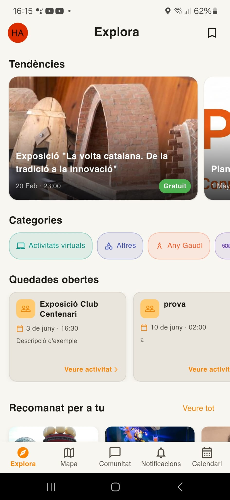
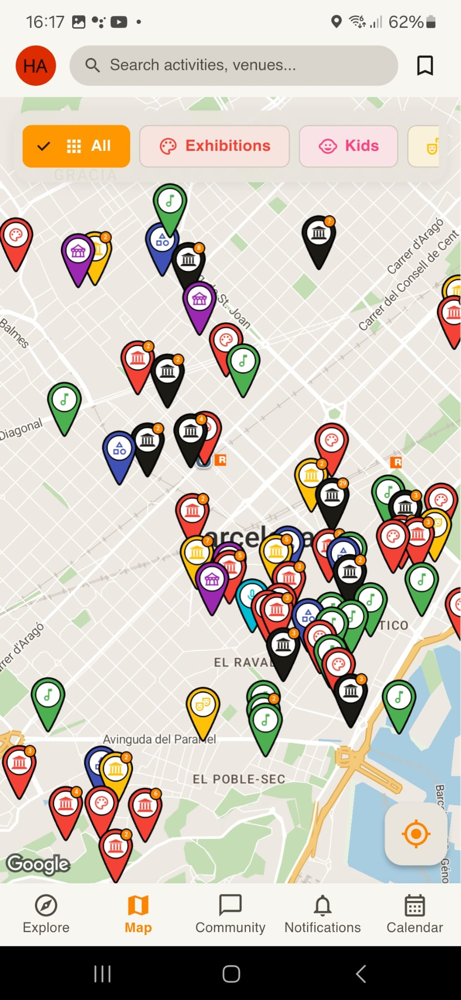
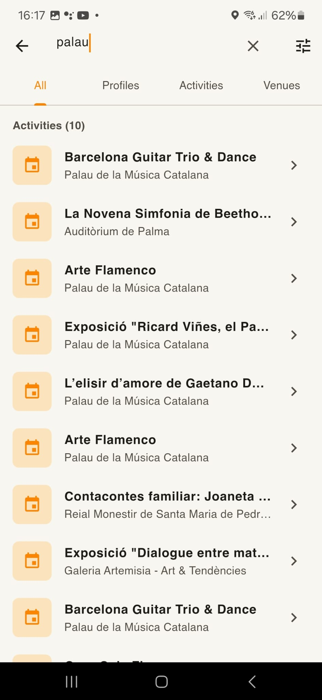
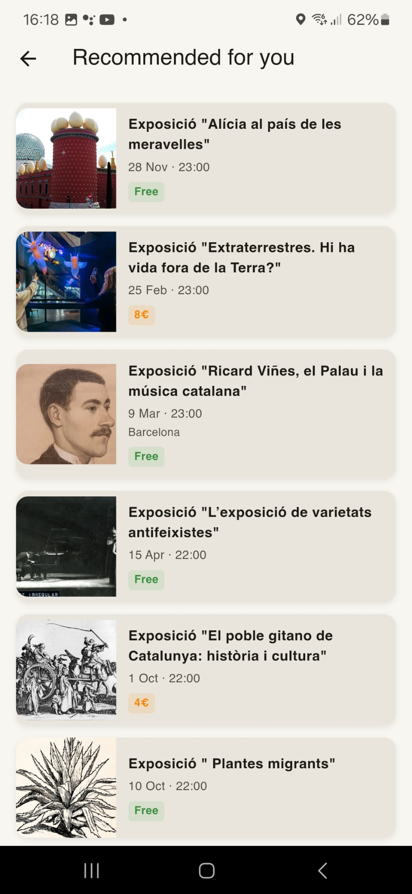
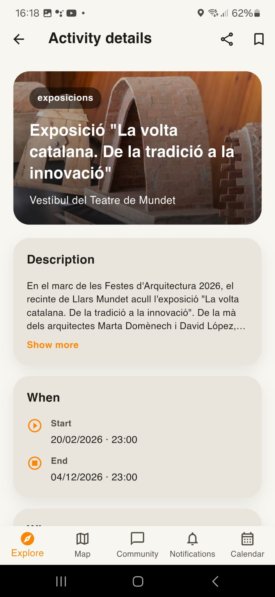
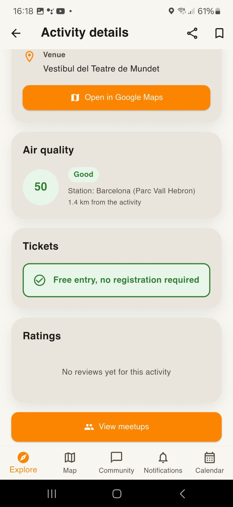
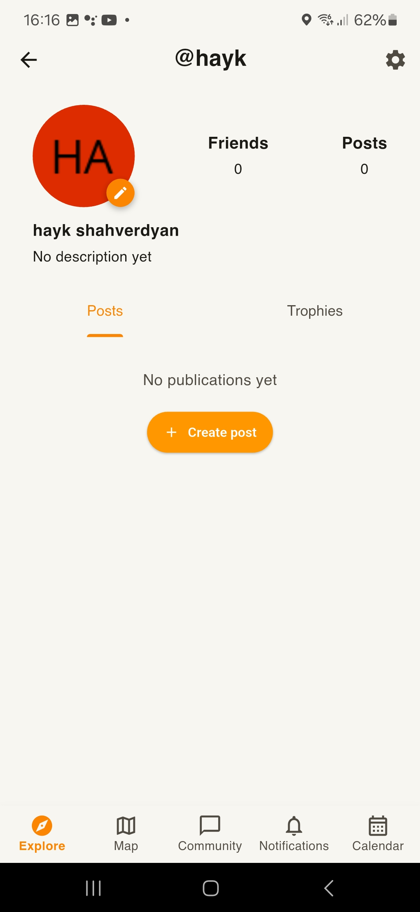
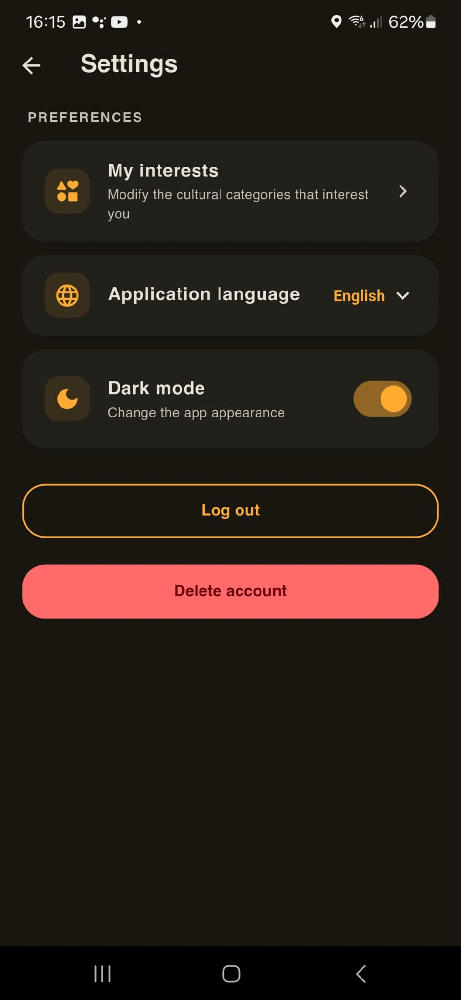
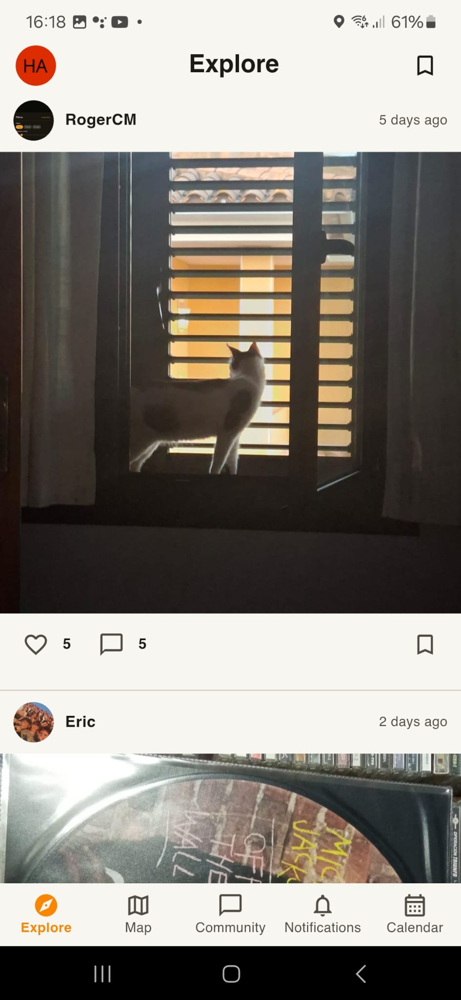

# PlanC — Frontend

[](https://flutter.dev/)
[](https://dart.dev/)
[](https://supabase.com/)
[](https://firebase.google.com/)
[](https://opensource.org/licenses/MIT)

> 🎓 This repository is a public mirror of a private organization repo developed during the **Software Engineering Project (PES)** course at **FIB — UPC** (2025–2026 Q2). The app was built by a team of 7 students over the course of a full academic semester, working in Scrum sprints with separate frontend and backend repositories.

---

## 📱 Try the app

Download and install the APK directly on your Android device — no need to build from source:

👉 **[Download APK — v1.0.0](https://github.com/shahverdyan/PlanC-Frontend/releases/tag/v1.0.0)**

> Requires Android 5.0 or higher. You may need to enable **"Install from unknown sources"** in your device settings.

---

## Table of contents

1. [Project description](#project-description)
2. [Screenshots](#screenshots)
3. [Team](#team)
4. [Tech stack](#tech-stack)
5. [Architecture and modules](#architecture-and-modules)
6. [Prerequisites](#prerequisites)
7. [Installation and setup](#installation-and-setup)
8. [Configuration variables](#configuration-variables)
9. [Available commands](#available-commands)
10. [Tests](#tests)
11. [Useful links](#useful-links)

---

## Project description

PlanC is a social mobile app that transforms the **Agenda Cultural de Catalunya** (Catalonia's official cultural events API) into a collective experience. Users can discover cultural events, organize meetups with friends, chat in real time, and earn points for their cultural participation.

This repository contains the Android mobile app built with Flutter. It communicates with the backend via REST API and WebSockets.

---

## Screenshots

| Explore feed | Map | Search |
|:---:|:---:|:---:|
|  |  |  |

| Recommended | Activity detail | Tickets & ratings |
|:---:|:---:|:---:|
|  |  |  |

| Profile — Posts | Profile — Trophies | Publications feed |
|:---:|:---:|:---:|
|  |  |  |

---

## Team

**Group FemBoys — PES Q2 2025–2026 · FIB, UPC**

| Member | Github | Email |
|---|---|---|
| Eric Ruiz | [eirc.ruiz.miro](https://github.com/ericruizmiro-star) | eric.ruiz.miro@estudiantat.upc.edu |
| Roger Guinovart | [rogerguinovart](https://github.com/rogerguinovart-maker) | roger.guinovart@estudiantat.upc.edu |
| Jordi Caballeria | [JordiCaballeriaUPC](https://github.com/JordiCaballeriaUPC) | jordi.caballeria@estudiantat.upc.edu |
| Aleks Shahverdyan | [Aleks](https://github.com/shahverdyan) | aleks.shahverdyan@estudiantat.upc.edu |
| Naia Cuní | [Naia](https://github.com/Nuuski) | naia.cuni.i@estudiantat.upc.edu |
| Roger Corcoles | [RogerCorcoles](https://github.com/RogerCorcoles) | roger.corcoles@estudiantat.upc.edu |
| Izan Jorge | [izanjorge](https://github.com/izanjorge) | izan.jorge@estudiantat.upc.edu |

---

## Tech stack

| Technology | Version | Purpose |
|---|---|---|
| Flutter | 3.41.6 (stable) | Mobile development framework |
| Dart | 3.11.4 | Programming language |
| flutter_riverpod | ^2.5.1 | State management and dependency injection |
| go_router | ^13.2.0 | Declarative navigation |
| dio | ^5.4.3 | HTTP client for REST API |
| supabase_flutter | ^2.5.0 | Authentication and file storage |
| google_maps_flutter | ^2.6.0 | Interactive map of cultural events |
| socket_io_client | ^3.1.4 | WebSockets for real-time chat |
| firebase_core | ^3.6.0 | Firebase initialization |
| firebase_messaging | ^15.1.3 | Push notifications (FCM) |
| geolocator | ^14.0.2 | Geolocation for attendance validation |
| flutter_secure_storage | ^10.0.0 | Secure token storage |
| table_calendar | ^3.1.2 | Calendar view of upcoming events |
| device_calendar | ^4.3.2 | Google Calendar integration |
| image_picker | ^1.2.1 | Profile photo and chat image selection |
| share_plus | ^12.0.2 | Share events from the app |
| intl | ^0.20.2 | Internationalization and date formatting |

---

## Architecture and modules

The app follows a **feature-based modular architecture** combined with **Clean Architecture** and the **MVVM** pattern at the presentation layer. Each feature is self-contained and organized into three layers: Presentation, Domain, and Data.

State management is handled with **Riverpod**, where `Notifier` classes act as ViewModels and widgets observe state via `ref.watch()`.

### Directory structure

```
lib/
├── core/          # Global config, HTTP clients, interceptors, theme
├── features/      # App modules (see table below)
├── l10n/          # Localization files (Catalan, Spanish, English)
├── shared/        # Shared widgets, models and utilities
└── main.dart      # App entry point
```

### Feature modules

| Module | Description |
|---|---|
| `auth` | 3-step registration, login, logout, email verification and Google OAuth |
| `map` | Interactive map with geolocated cultural events and filters |
| `activitats` | Activity detail, associated meetups, ratings and geolocation-based attendance validation |
| `groups` | Meetup creation and management, participants and group chat |
| `chat` | Individual and group chats, real-time messaging and image sharing |
| `amistats` | Friend requests, friends list and suggestions |
| `perfil` | User profile, data editing, photo and bio |
| `notificacions` | Push notification history and unread badge |
| `feed` | Activity discovery feed and publications feed |
| `publicacions` | Posts about activities, likes and comments |
| `interaccions` | Likes, comments and replies on posts |
| `cercador` | Search for activities and user profiles |
| `preferits` | Activities saved by the user |
| `calendari` | Calendar view of events the user has signed up for |
| `navigation` | Global bottom navigation bar and main routing |
| `settings` | Account settings and app preferences |
| `gustos` | Cultural interest category selection |
| `redireccioCompraEntrades` | Redirect to ticket purchase for an activity |

---

## Prerequisites

- **Flutter** 3.41.6 or higher (stable channel)
- **Dart** 3.11.4 or higher
- **Android SDK** with API level 21 (Android 5.0) or higher
- **Android Studio** or **VS Code** with Flutter and Dart extensions
- A `google-services.json` file (Firebase) placed at `android/app/`
- Access to the deployed backend (or running it locally)

> ⚠️ This app supports **Android only**. iOS is not configured in this repository.

---

## Installation and setup

### 1. Clone the repository

```bash
git clone https://github.com/shahverdyan/PlanC-Frontend.git
cd PlanC-Frontend
```

### 2. Install dependencies

```bash
flutter pub get
```

### 3. Configure Firebase

Place the `google-services.json` file at:

```
android/app/google-services.json
```

> ⚠️ This file contains credentials and is not included in the repository. Contact a team member to get it.

### 4. Configure Supabase credentials

In `lib/main.dart`, fill in the Supabase URL and anon key:

```dart
await Supabase.initialize(
  url: 'YOUR_SUPABASE_URL',
  anonKey: 'YOUR_SUPABASE_ANON_KEY',
);
```

> ⚠️ These credentials are not included in the repository. Contact a team member to get them, or set up your own Supabase project.

### 5. Run the app

```bash
flutter run
```

---

## Configuration variables

Flutter does not natively support `.env` files. Sensitive configuration is handled as follows:

- **`google-services.json`** — Firebase config file placed at `android/app/`. Not included in the repository.
- **Supabase credentials** — URL and anon key set directly in `lib/main.dart`. Not included in the repository.
- **Google Maps API key** — set in `android/app/src/main/AndroidManifest.xml` under the `com.google.android.geo.API_KEY` meta-data field. Not included in the repository.

---

## Available commands

```bash
# Run the app in debug mode
flutter run

# Build debug APK
flutter build apk --debug

# Build release APK
flutter build apk --release

# Run all tests
flutter test

# Static code analysis
flutter analyze

# Install dependencies
flutter pub get

# Clean build artifacts
flutter clean

# Generate localization files
flutter gen-l10n
```

---

## Tests

The project uses the official **flutter_test** package for widget and unit tests, and **mockito** for mocks.

```bash
# Run all tests
flutter test

# Run a specific test folder
flutter test test/features/cercador/
```

### Test coverage by feature

| Feature | Test files |
|---|---|
| `cercador` | domain, providers ×2, widgets |
| `groups` | datasources, repository, models ×2, provider, screens, widgets |
| `redireccioCompraEntrades` | repository, usecase ×2 with mocks, widget |
| Root | widget_test.dart |

**Total: 16 test files** across 3 features and the root test.

---

## Useful links

| Resource | URL |
|---|---|
| Frontend repository | https://github.com/shahverdyan/PlanC-Frontend |
| Backend repository | https://github.com/shahverdyan/PlanC-Backend |
| Deployed backend | https://planc-backend-aff2.onrender.com |
| API docs (Swagger) | https://planc-backend-aff2.onrender.com/api/docs |
